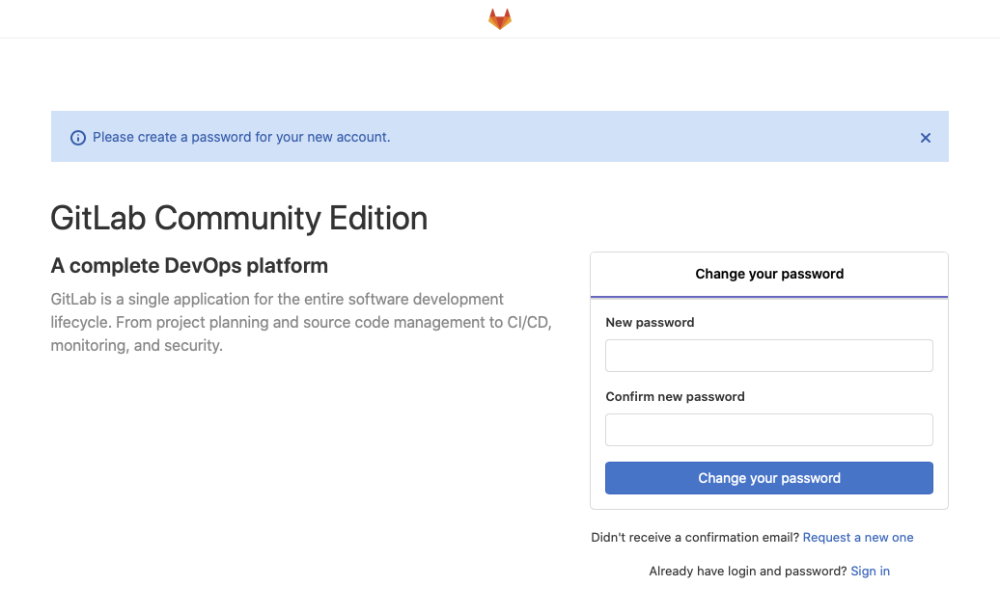
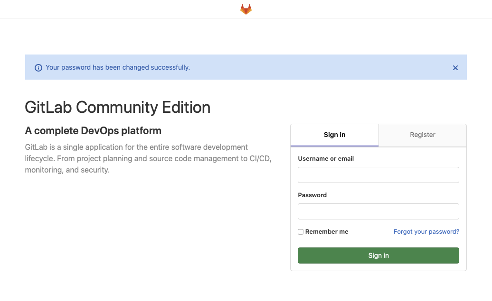
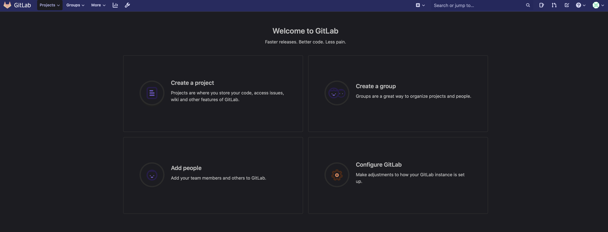
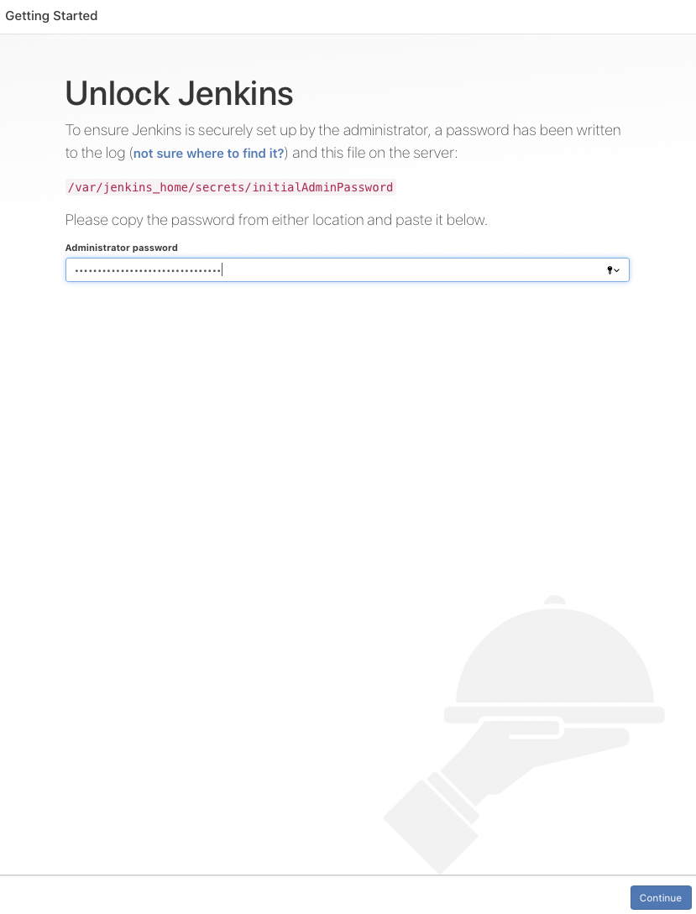
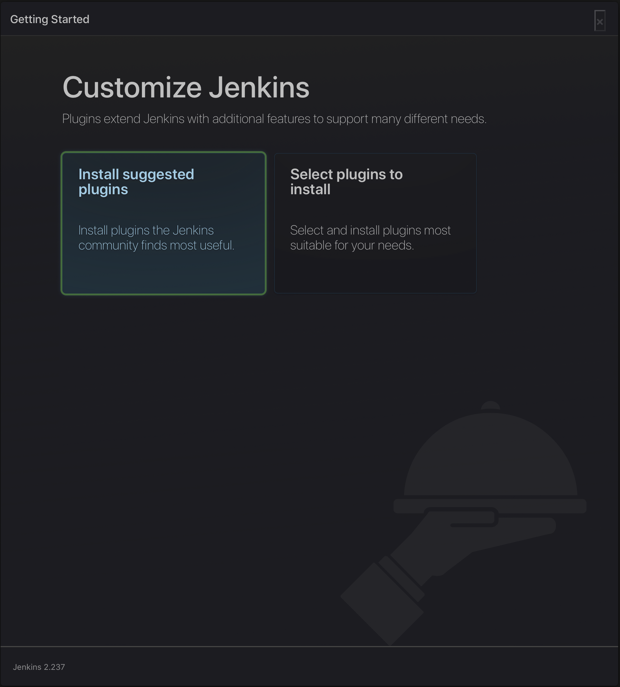
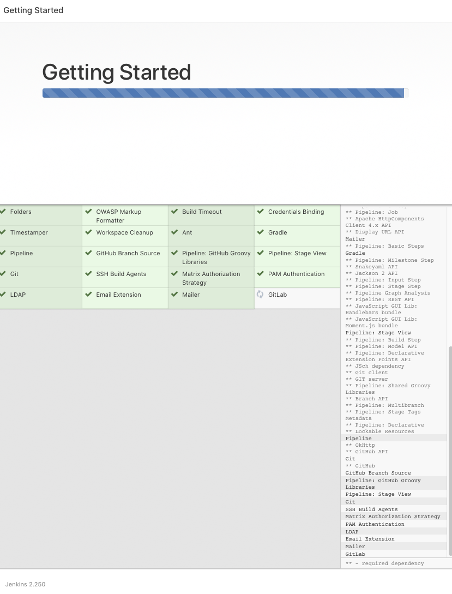
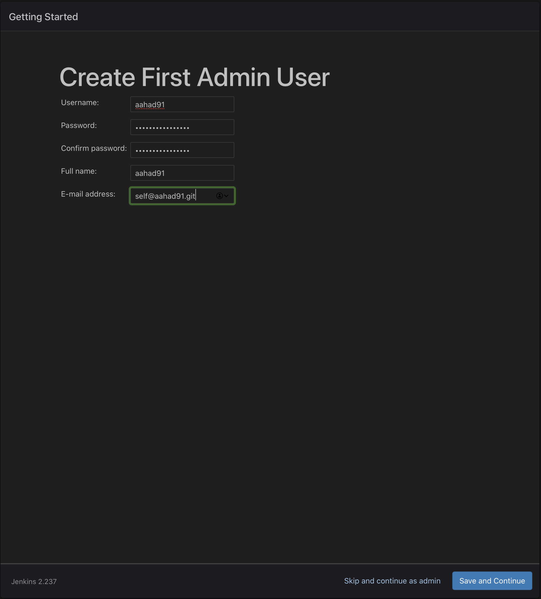
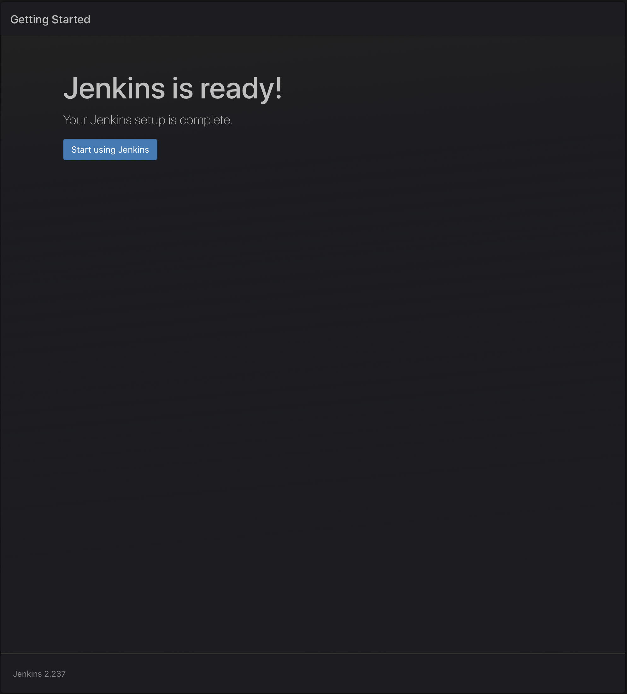
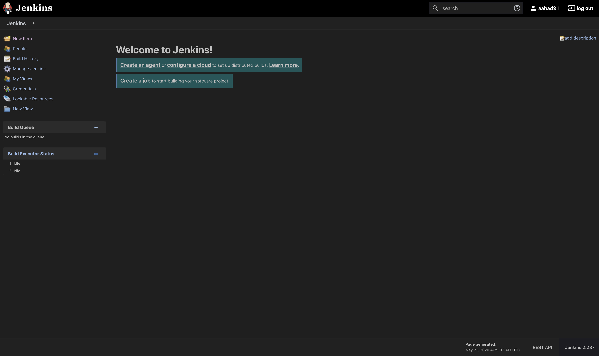

# git-jenk-dock
## Docker-based solution for GitLab and Jenkins

### Documentation for Installation and Integration

#### Requirement

- Docker (Installed)
- Docker-compose (Installed)

### Installation

```bash
sudo docker-compose -f docker-compose.yaml up
```

#### Urls

Browse to following Urls to verify successfull installation of Gitlab and Jenkins

- **Gitlab:** http://localhost:8081
- **Jenkins:** http://localhost:8081

#### Gitlab Configuration

- After browsing to above mentioned url of gitlab, initial registration page will show up. Set the new password for root user of Gitlab.



- Login with the newly created password



- Gitlab Homepage



#### Jenkins Configuration

- Browse to above mentioned url of jenkins and get the Administrator password from the mentioned path:

```bash
sudo docker exec -it jenkins cat /var/jenkins_home/secrets/initialAdminPassword
```



- Select the "Install suggested plugins".



- Wait till all the plugins are installed.



- Set Admin user and password.



- Set the default url for jenkins for 3rd party access. For-example integration with gitlab and email configuration.


- All set!



- Jenkins Homepage


