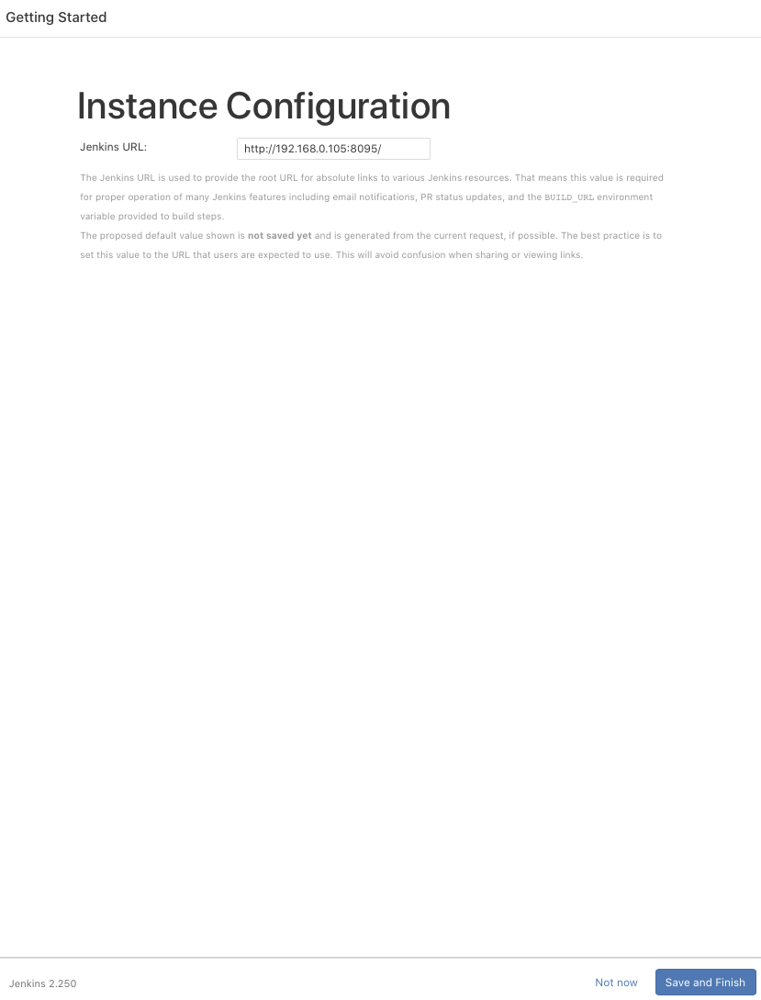
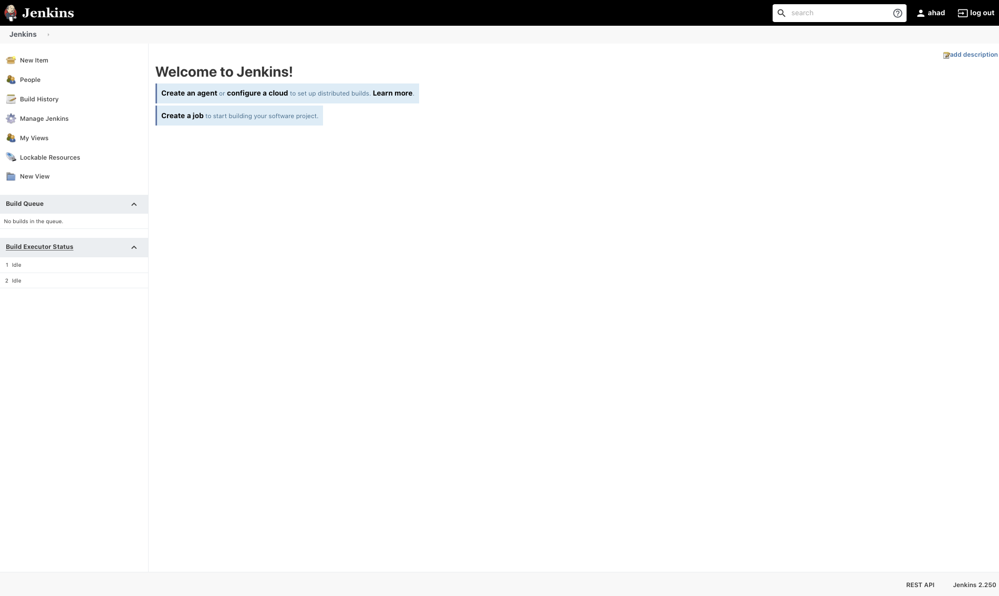
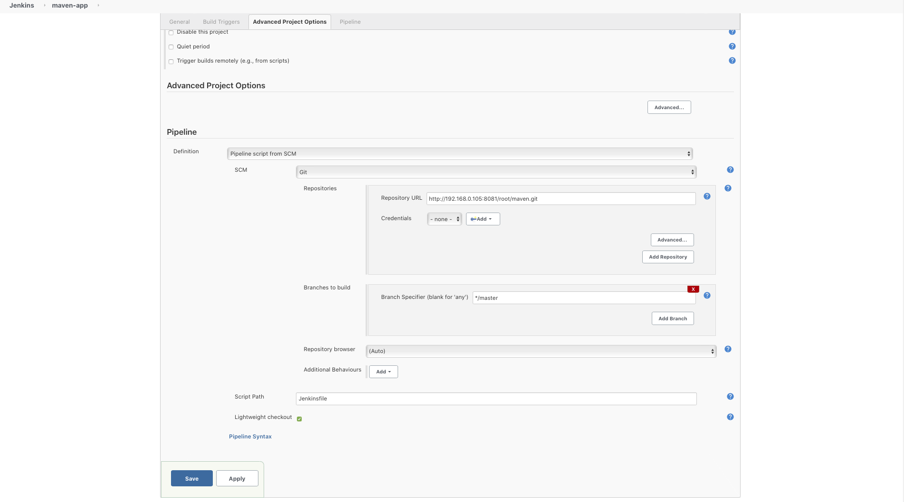

# git-jenk-dock
## Docker-based solution for GitLab, GitLab Runner and Jenkins

### Documentation for Installation, Integration and Pipeline Testing

#### Requirement

- Docker (Installed)
- Docker-compose (Installed)

### Installation

```bash
sudo docker-compose -f docker-compose.yaml up

#New terminal
sudo docker exec -it -u root jenkins chmod 777 /var/run/docker.sock
```

#### URLs

Browse to following Urls to verify successful installation of Gitlab and Jenkins

- **Gitlab:** http://localhost:8081
- **Jenkins:** http://localhost:8095

#### Gitlab Configuration

- After browsing to above mentioned url of gitlab, initial registration page will show up. Set the new password for root user of Gitlab.


- Login with the newly created password


- Gitlab Homepage


#### Jenkins Configuration

- Browse to above mentioned url of jenkins and get the Administrator password from the mentioned path:

```bash
sudo docker exec -it jenkins cat /var/jenkins_home/secrets/initialAdminPassword
```


- Select the "Select plugins to Install" and enable gitlab.


- Wait till all the plugins are installed.


- Set Admin user and password.


- Set the default url for jenkins for 3rd party access. For-example integration with gitlab and email configuration.



- All set!


- Jenkins Homepage



### Integration

Sample [Jenkinsfile](https://github.com/aahad91/git-jenk-dock/blob/master/Jenkinsfile) for pipeline testing.

#### Gitlab

- Generate authentication token. *Navigate to **Settings** > **Access Token***. Do as follow:


#### Jenkins

- Add connection to Gitlab from jenkins. *Navigate to **Manage Jenkins** > **Configure System***. Search for Gitlab tab. Add Name, Url of gitlab, token and test the connection as follow.


### Test Pipeline

#### Gitlab

- Click on "Create a Project".


- Click on "Import Project", after that "Repo by URL" and paste the repo: **https://github.com/aahad91/git-jenk-dock.git**. Set project to public and finally click on Create project.


#### Jenkins

- From Home page click on "New Item". Add the name for pipeline and select pipeline.


- In pipeline section, select "Pipeline script from SCM" and set SCM to "Git". Afterwards add URL of the git repo.



- Click on Build now to test the pipeline.


- Verfiy the pipeline is executed successfully.


### Gitlab Runner Integration

#### Gitlab

- Navigate to ***Admin Area*** > ***Runners*** and copy the ***Registration Token***.


#### Gitlab Runner

```bash
# Command to register runner with gitlab
gitlab-runner register -n --url http://<gitlab-ip>:80/ --registration-token {token from gitlab} --clone-url http://<gitlab-ip>:80/ --executor docker --docker-image "docker:latest" --docker-privileged

# Execute
sudo docker exec -it gitlab-runner gitlab-runner register -n --url http://172.22.0.3:80/ --registration-token F8BoGetFnszYx91FT2ro --clone-url http://172.22.0.3:80/ --executor docker --docker-image "docker:latest" --docker-privileged
```

- Verify the added runner.


------

