# git-jenk-dock
## Docker-based solution for GitLab, GitLab Runner, Jenkins and SonarQube

### Documentation for Installation, Integration, Plugins Installation and Pipeline Testing

#### Requirement

- Docker (Installed)
- Docker-compose (Installed)

### Installation

```bash
#For Ubuntu to resolve virtual memory issue of Sonarqube
sudo sysctl -w vm.max_map_count=262144

sudo docker-compose -f docker-compose.yaml up

#New terminal
sudo docker exec -it -u root jenkins chmod 777 /var/run/docker.sock
```

#### URLs

Browse to following Urls to verify successful installation of Gitlab, Jenkins and SonarQube.

- **Gitlab:** http://localhost:8081
  - **Login:** 
  - **Password:** 
- **Jenkins:** http://localhost:8095
  - **Login:** 
  - **Password:** 
- **SonarQube:** http://localhost:9000
  - **Login:** admin
  - **Password:** admin 

#### Gitlab Configuration

- After browsing to above mentioned url of gitlab, initial registration page will show up. Set the new password for root user of Gitlab.


- Login with the newly created password


- Gitlab Homepage

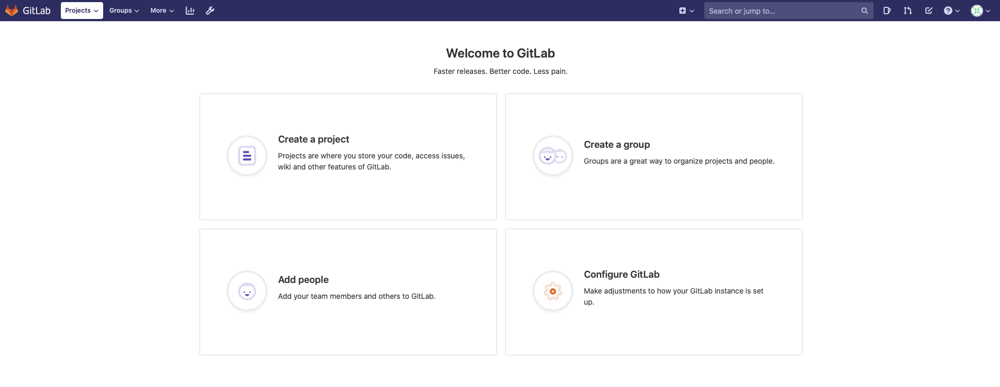

### Gitlab Runner Integration

#### Gitlab

- Navigate to ***Admin Area*** > ***Runners*** and copy the ***Registration Token***.

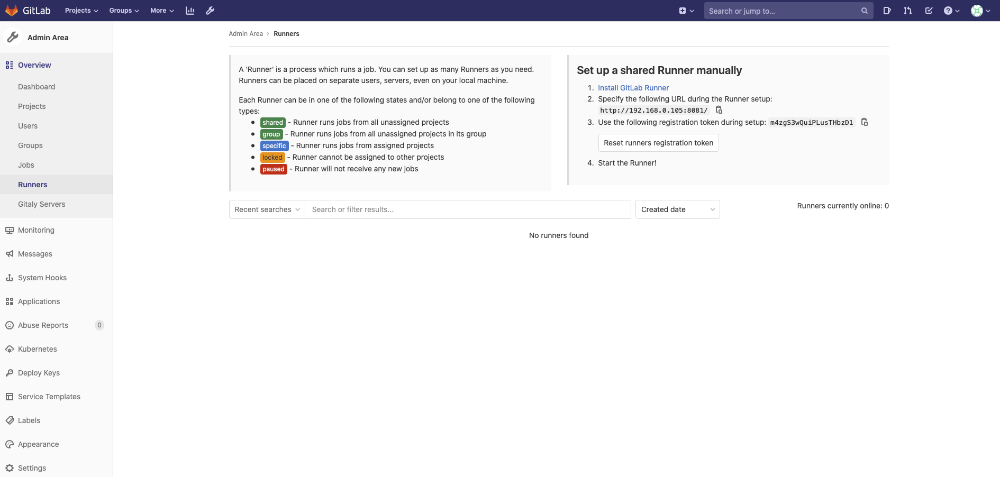

#### Gitlab Runner

```bash
# Command to register runner with gitlab
gitlab-runner register -n --url http://<gitlab-ip>:80/ --registration-token {token from gitlab} --clone-url http://<gitlab-ip>:80/ --executor docker --docker-image "docker:latest" --docker-privileged

# Execute
sudo docker exec -it gitlab-runner gitlab-runner register -n --url http://192.168.0.105:8081/ --registration-token m4zgS3wQuiPLusTHbzD1 --clone-url http://192.168.0.105:8081/ --executor docker --docker-image "docker:latest" --docker-privileged
```

- Verify the added runner.

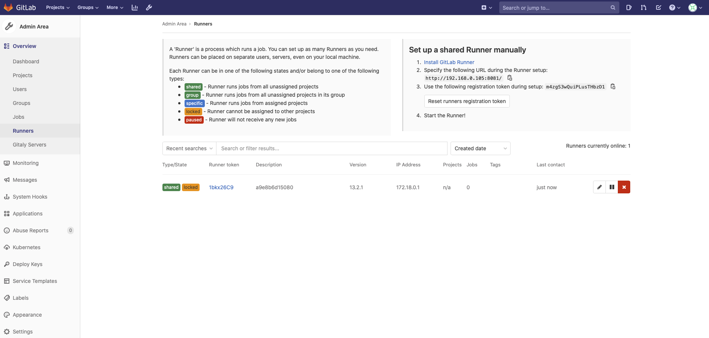

#### Jenkins Configuration

- Browse to above mentioned url of jenkins and get the Administrator password from the mentioned path:

```bash
sudo docker exec -it jenkins cat /var/jenkins_home/secrets/initialAdminPassword
```


- Select the "Select plugins to Install", search and enable gitlab, afterwards click on the Install.

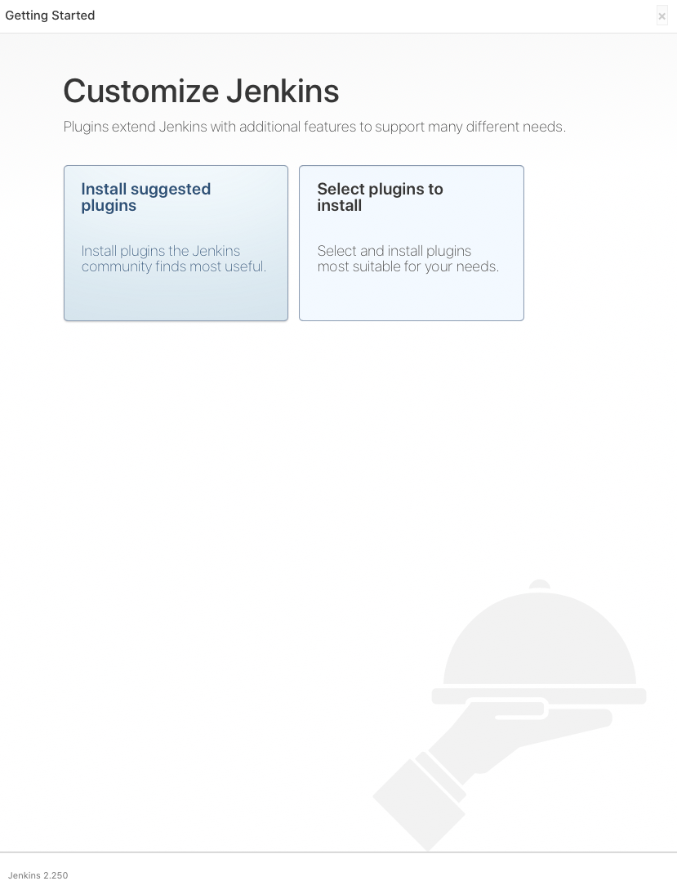

- Wait till all the plugins are installed.


- Set Admin user and password.

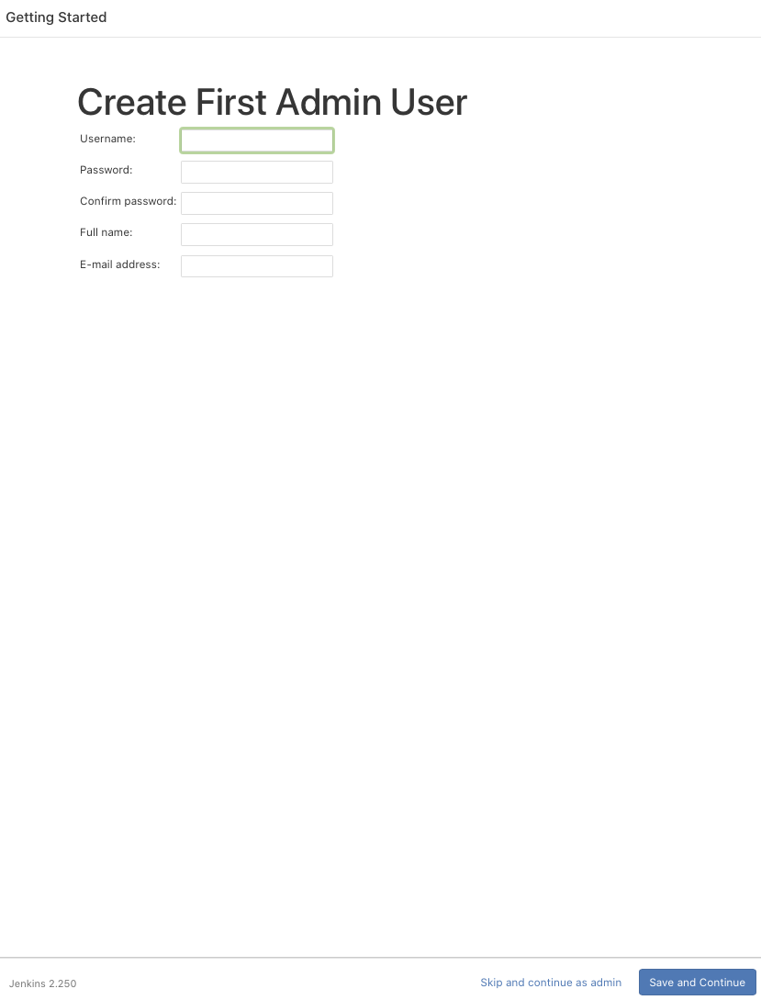

- Set the default url for jenkins for 3rd party access. For-example integration with gitlab and email configuration.


- All set!


- Jenkins Homepage


#### Installing required plugins for Jenkins

- OWASP Dependency-Check
- Docker
- Docker pipeline
- Navigate to **_Manage Jenkins_** > **_Manage Plugins_**. Click on ***Available*** tab and search for OWASP Dependency-Check and Docker afterwards click on Download now and install after restart.

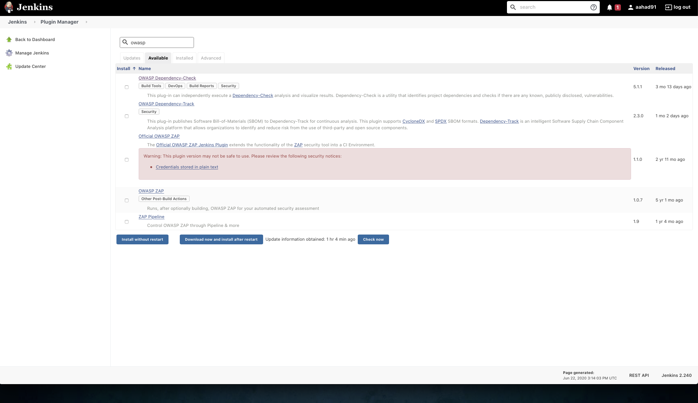


- Verify the successfull installation of OWASP Dependency-Check plugin by navigating to **_Manage Jenkins_** > **_Manage Plugins_** and click on ***installed*** tab.

 

### Integration of Gitlab and Jenkins

#### Gitlab

- Generate authentication token. *Navigate to **Settings** > **Access Token***. Do as follow:


#### Jenkins

- Add connection to Gitlab from jenkins. *Navigate to **Manage Jenkins** > **Configure System***. Search for Gitlab tab. Add Name, Url of gitlab, token and test the connection as follow.

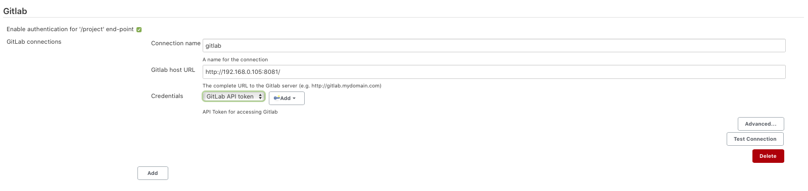


### SonarQube

- Browse ot Url http://localhost:9000 


- Click on login and enter the credentials for the first login and later can be changed to desired password:
  - Username: admin
  - Password: admin


#### Installing OWASP Dependency Checker for SonarQube

- Click on ***Administration*** -> ***Marketplace***. Type dependency-check in search bar and click install. 


- Click on ***Restart Server*** on the top to proceed the installation.


- Verify the successfull installation of OWASP Dependency Checker plugin. Navigate to ***Administration*** > ***Marketplace***, and click on Plugins installed.


### Test Pipeline

#### Gitlab

- Click on **Create a project** and select **Import Project**, after that copy and paste the repo: **https://github.com/aahad91/maven.git**. Set project to public and finally click on Create project.


#### Jenkins

##### Pipeline

- From Home page click on "New Item". Add the name for pipeline and select pipeline.


- Under Build Triggers section, select "Build when a change is pushed to GitLab. GitLab webhook URL: http://192.168.0.105:8095/project/maven-dependency-check".


- In pipeline section, select "Pipeline script from SCM" and set SCM to "Git". Afterwards add URL of the git repo.


- Click on Build now to test the pipeline.

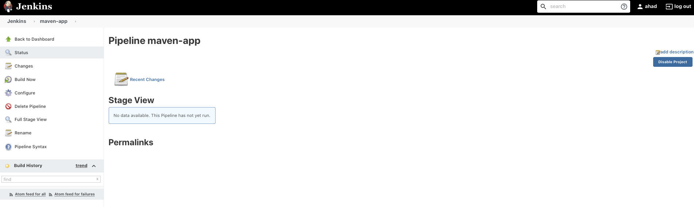

- Verfiy the pipeline is executed successfully.

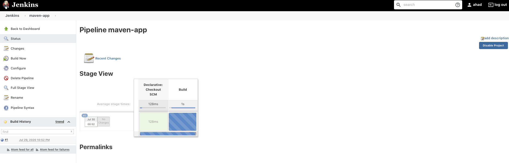


##### Dependency check

- Configure the OWASP dependency check. Navigate to ***Manage Jenkins > Global Tool Configuration***. In Dependency-Check section, click on **Add Dependency-Check**. Set the name and click save.

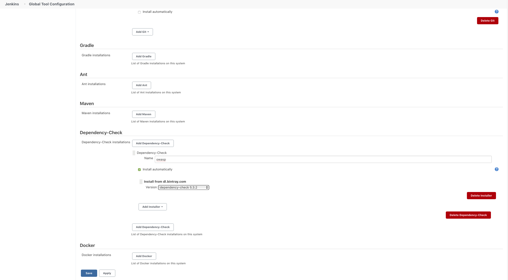

- From Home page click on "New Item". Add the name and select freestyle project.


- In settings, under Source Code Management section. Add the repository Url.


- Under Build Triggers section, select "Build when a change is pushed to GitLab. GitLab webhook URL: http://192.168.0.105:8095/project/maven-dependency-check"


- Under Build section select **Invoke Dependency-Check** and under Post-build Actions select **Publish Dependency-Check results**. For build section, in Arguments add the following and click on save:
  - --format XML
  - --format HTML


- Click on **Build Now** to see the results.


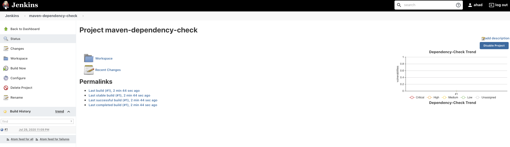

##### Gitlab webhook for automatically triggering Jenkins pipeline and OWASP Dependency-Check


#### Gitlab Runner and SonarQube

##### SonarQube

- From the main page click on **Create new project**. Add the **Project-key** and click on Set Up.


- Provide the name for the Key and click on Generate. Copy the token.


##### Gitlab

- Edit the **.gitlab-ci.yml**. Add the token and SonarQube Url then Commit.


- Navigate to ***CI/CD > Pipelines***. To verify the Gitlab Runner pipeline.


##### SonarQube

- Verify the analysis on SonarQube.


------

